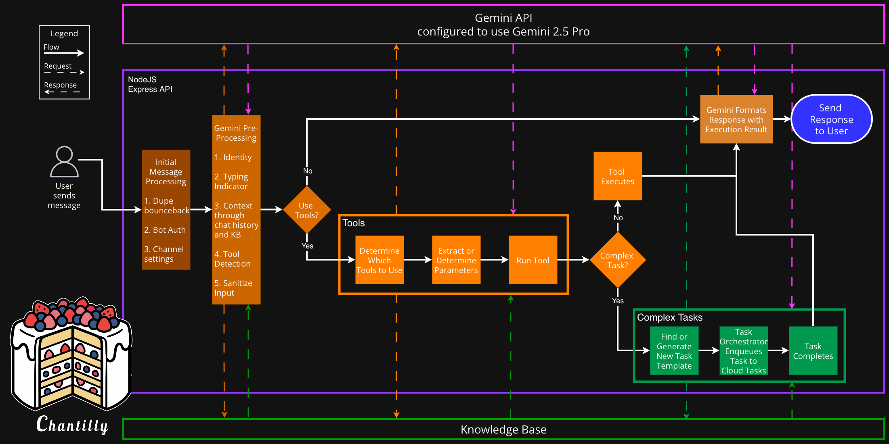

# Chantilly ADK: Enabling any LLM to retain expert knowledge, use tools, and invoke self-repairing complex tasks

#### Rabshan Rahman Founder @ [DeepAuras.com](http://DeepAuras.com)

**Abstract.** True agentic AI systems would allow organizations to generalize across tasks with minimal supervision. Although model providers continue expanding their offerings, realizing these benefits remains elusive: interoperability is limited and agenticness is questionable. We propose the Chantilly Agent Development Kit (ADK): a solution that maximizes agenticness through battle-tested best practices and leading-edge design. The ADK uses widely available technology and remains agnostic to LLM choice, providing a path for agentic systems to gain mission-critical functionality needed for production and enterprise use cases.       

## Introduction

Since ChatGPT was released to the public late in 2022, there has been a mad fervor to implement LLMs into operational workflows. Traditional web search has fallen out of use as more users use LLMs as their first stop for information gathering. But beyond information retrieval and generating images or videos, the productivity gains or resource-saving features that were promised by Big Tech are not well realized. At least not by their own product offerings. Until recently, users did not have the ability to teach or correct the LLM. Furthermore, since these products are being developed in a closed way, the interoperability between LLMs and 3rd-party systems is limited. 

In 2023, through a partnership with OpenAI, Microsoft released Copilot Studio with the claims that you could create your own agents. Users could add curated knowledge bases and tools that enable the interoperability sorely missing from ChatGPT. Microsoft touted a polished UI with a topic editor that enabled users to create complex decision chains based on responses. On top of all that, Microsoft pushed the narrative that anyone can use Copilot Studio effectively as a “low code” development platform. Even after 2 years, Microsoft is still failing and delivering instead what can be described as *hyped-up, hot garbage*.

Google released Vertex AI API in 2019 and their Gemini API late 2023, with the first published a [guide to developing agents](https://cloud.google.com/blog/topics/developers-practitioners/learn-how-to-create-an-ai-agent-for-trip-planning-with-gemini-1-5-pro) in November 2024\. The guide demonstrated the ability to use function calling (tool use) and grounding (enhancing LLM processing with external data). However the resulting Python application is a far cry from being a production-ready, enterprise agent that could handle many users’ concurrent messages/requests. Furthermore, complex tasks that involve data enriching, steps with looping or mapping, and analysis are not discussed. This illustrates the dilemma between the offerings of Google and Microsoft. With Gemini, Google gives us a blank canvas that still requires experienced developers to produce viable agents. With Copilot Studio, Microsoft gives us a coloring book made by a dehydrated methhead. 

This project aims to provide a blueprint for developers to build production-ready, enterprise agents on top of any LLM. Although Chantilly officially uses Gemini/Vertex and Google Cloud, you could easily swap in any other LLM api and hyperscaler to rapidly develop and deploy agents that:

* Does not leak PII and sensitive data to the model provider  
* Use vector embeddings to search the knowledge base, tool registry, and task templates  
* Includes 5 system tools and 3 integration tools to serve as the cookbook for development  
* Includes webhook services for:  
  * Google Chat  
  * Bitrix24  
  * WhatsApp  
  * Bluesky  
  * Shopify  
* Complex task creation via natural language that can self-repair using [ReasoningBank](https://arxiv.org/abs/2509.25140) 

Chantilly requires basic web development skills and having DevOps chops helps as well. The GitHub repository will have much more in depth information on deployment, configuring and optimizing the infra, developing new custom tools, and bootstrapping complex tasks.     

## Definitions

Note: Definitions were borrowed from OpenAI’s paper [Practices for Governing Agentic AI Systems](https://cdn.openai.com/papers/practices-for-governing-agentic-ai-systems.pdf)

model developer \- “the party that develops the AI model that powers the agentic system, and thus broadly sets the capabilities and behaviors according to which the larger system operates”

system deployer \- “the party that builds and operates the larger system built on top of a model, including by making calls to the developed model (such as by providing a “system prompt”), routing those calls to tools with which the agent can take actions, and providing users an interface through which they interact with the agent”

agentic ai system \- “systems that are characterized by the ability to take actions which consistently contribute towards achieving goals over an extended period of time, without their behavior having been specified in advance”  
   
agenticness \- “the degree to which a system can adaptably achieve complex goals in complex environments with limited direct supervision” 

user \- “the party that employs the specific instance of the agentic AI system, by initiating it and providing it with the instance-specific goals it should pursue”

## Benefits & Criticisms

Using Chantilly enables organizations and projects to rapidly deploy agents that can immediately start generating revenue or cutting costs. Adopters are leap-frogging the offerings of model developers and within hours becoming system deployers using widely available cloud technologies. Chantilly is open-source and built with open-source technology, thus there are no licensing fees, significantly reducing the cost of any digital transformation or AI implementation.

Chantilly does have costs associated with deploying and operating agents. Additionally, Chantilly is not an “off-the-shelf” system that can produce agents that automagically work. Instead, think of Chantilly as a *training system* for AI employees or project contributors. There are monetary and time costs associated with producing agents with Chantilly, just as there would be with training valuable employees or project contributors. Although it is possible to refactor Chantilly to run completely on-premises infra, Chantilly’s dependence on cloud technology implies that you will end up with a bill from your model developer and cloud provider for using this system.

Chantilly is written in JavaScript. Take that as a benefit or criticism at your own volition.

Figure 1. Flow Diagram

Chantilly’s flow is simple: we leverage the LLM to analyze and infer what decisions to make. Notice how evaluating user responses or tool use is *not branched.*

## Overview of Chantilly's Layers

1. Backend Layer \- NodeJS & Express for I/O  
2. LLM \- Provides the basis for semantic reasoning  
3. Knowledge Base \- Database with vector embeddings  
4. Tools / Services / Models \- .js/.ts files that run locally for fast response, facilitate interoperability, and data access  
5. Complex Tasks \- .ts/.js code that queued to Cloud Tasks for parallel execution

Chantilly is fairly straightforward and is similar to most web applications. The biggest difference is with other web applications, there is an overt need for a graphical user interface. With agentic ai systems, the agents themselves are the UI and the controller. This leads to a double-edge sword: time saved on UI/UX is instead transferred to managing the infinite edge cases of agency. Thus system deployers may find themselves developing *new concepts and processes* instead of writing code. Along with managers and business stakeholders, we must consider how SOPs (that may work today) may be too brittle to handle the unimaginable scale of agent output.

NodeJS as the runtime provides us these key benefits:

* Asynchronous operations  
* Tons of hipster developers who are familiar with writing secure code for it  
* Ubiquitous to all cloud providers

There are alternatives to Node that would have performance gains, but it has been battle tested over and over. Therefore Node was chosen to serve as the backbone of Chantilly. Within it, the Express framework is used to manage inbound webhooks (external, event-triggered requests) and middleware that effectively connects the other layers together. Referring to figure 1, we can see most of the steps involve making a pair of requests and responses to the Knowledge Base as well as Gemini. This backend design significantly improves the consistency of agenticness. Chantilly agents are thus grounded in curated truth while semantically reasoning throughout the flow.

The LLM layer is provided by model developers through their APIs and web services. Model developers allow you to select which model to use and this choice has a significant impact on overall performance and cost of running the agent. For agents that do not require advanced reasoning or extensive pre-trained parameters, system deployers may opt to use models focused on efficiency and be more budget friendly. For agents with high-value objectives, system deployers may opt instead to select the most advanced or latest models. The trade off is most noticeable when agents are attempting to create a new complex task and self-repair these tasks. Additionally, system deployers can select the latest models to create complex tasks and bootstrap the agent. Then they can switch models and perform A/B testing on various metrics to choose the most appropriate model.   

## Knowledge Base

The Knowledge Base is the application of database technology to effectively allow users to reliably add information to ensure accuracy, relevancy, and safety. Although coined *retrieval-augmented generation (RAG)* by [researchers in 2020](https://dl.acm.org/doi/abs/10.5555/3495724.3496517), Chantilly extensively uses this pattern throughout the architecture.

When and how grounding is used significantly reduces hallucinations and thus increases agent efficacy. There are 5 main touchpoints of grounding:

| Occurrence                   | Frequency                | Purpose                             |
|------------------------------|--------------------------|-------------------------------------|
| Automatic message grounding  | Every user message       | Prevent generic AI responses        |
| Tool context grounding       | Every tool execution     | Tools access KB knowledge           |
| Complex task grounding       | Task creation/execution  | Ground agentic tasks in patterns    |
| API search grounding         | On-demand via REST       | External integrations               |
| Security sanitization        | Before all AI calls      | OWASP-compliant grounding           |

   
The Knowledge Base is not a magic bullet against hallucinations or for creating deterministic paths for the agent. This is one of the major aspects that differentiates agentic ai systems from classical software: the outcomes and precision is *human-like*. How well humans perform on assigned tasks depend largely on their accrued knowledge. Either through education, training, or experience, humans improve their outcomes and precision to account for the probabilistic nature of their thinking.

Consider this example: a brilliant brain surgeon is diagnosed with dementia. As the disease progresses, they will not be able to provide guarantees on their surgeries and skills. The disease destroys their accrued knowledge, experience, and their grounding to reality. This harrowing metaphor highlights the criticality of the Knowledge Base.

Thankfully, you can backup and roll-back Chantilly Knowledge Bases with the right database configuration. Additionally, it is important to start considering the concept of “knowledge hygiene” and implementing standards to curate knowledge. The default schema of the Knowledge Base allows users to organize documents with built-in fields such as priority, category, tags, searchTerms, and vector embeddings. However, it's important to prevent contradictions within the Knowledge Base and adhering to the standards for curation. In a sense, this is the practice of “prevention is the best cure”, but here we are tasked with preventing problematic knowledge conflicts and misinformation.  

## Tools

Tool creation and calling (execution) is now a standard feature offered by the model providers. Users can observe this when ChatGPT or Claude uses the web search tool or using the fetch or curl tool to read the content on web sites for real-time information. Tools are files and code that can be executed by agents within the main I/O thread. The execution happens sequentially in real-time and the tool output is used to generate the next response to the user. Tools can be used to integrate agents with 3rd-party APIs, handle file uploads and specific content/data types, query databases, and establish guarantees for mission critical functions. Although LLMs are able to generate files and code for tools, tool creation should be relegated to experienced developers for deployment and fine tuning. Tools flow through Chantilly in the following way:

Registration → Discovery → AI Selection → Execution → Result Return

In Chantilly, tools are stored as .js (or .ts) files inside the /tools/ directory. Tools compiled in the Docker image enable the LLM to control input parameters, have fast execution, and semantic response handling. Every tool file must:

1. Export a class that extends BaseTool  
2. Define static properties (name, description, parameters, etc)  
3. Implement standardized methods

Chantilly comes with a few tool files:

* knowledgeManagement \- users can add, modify, delete, and organize information  
* webBrowser \- enables the agent to browse websites  
* webSearch \- enables the agent to perform web search  
* drawioGenerator \- enables the agent to make ergodic charts and diagrams  
* complexTaskManager \- creates and executes complex multi-step tasks for long-running operations like reports and analysis  
* taskTemplateManager \- users can add, modify, delete, and organize complex task templates  
* taskManagement \- users can check status, cancel tasks, list running tasks, and view task history

The tool files serve as working examples to develop novel and customized tools by system deployers. Additionally, Chantilly’s framework includes 2 key facets: services and models. With this architecture, concerns are separated into: 

* Tools \= AI interface  
* Services \= Business logic  
* Models \= Data access

 

## Services

Tool files are just thin wrappers that call the underlying service to do all the actual work. The service files contain the core functionality governed by real-world rules that determine how data can be created, stored, and changed. Services can be reused by multiple tool files and can be easily extended to include more endpoints and logic. This ensures that related tools do not conflict or produce inconsistent results.

There are several *system services* that ensure the smooth execution of Chantilly’s features:

* gemini \- LLM driven routing and API requesting. This is a working example meant to be refactored for other model providers like Anthropic or OpenAI  
* embeddingService \- create and use vector embeddings for semantic search  
* knowledgeBase \- searches documents and stores information  
* memoryExtractor \- searches memories for the ReasoningBank self-repair process  
* taskOrchestrator & taskTemplateLoader \- Creates/manages tasks & templates, worker processes

When adding new integrations or capabilities to Chantilly agents, determining what the first tool should do is a good starting place. The tool concept can then provide the basis for developing the underlying service and the rules that will govern safe operation.

## Models

Model files provide the data abstraction layer that enables the agents to effectively store data within their agent system. The model specifications depend on the technology used, i.e. what database is used to store the information. Since Chantilly is configured for Google Cloud by default, model files are specific to Firestore. Regardless if system deployers are using Firestore or a different database, model files must be:

* In a singleton pattern with getter functions  
* Follow model structure that instantiates:  
  * Database connection   
  * Collection or table  
  * Lazy initialization

With this model structure we can ensure that there is 1 source of truth, we can easily mock the models in unit tests, and enforce access controls. Moreover, each searchable element within Chantilly benefits as vector embeddings are natively stored in the database. Putting tools, services, and models together we end up with the following flow:

Tools Call Services → Services Call Models → Models Calls the Database

This chain ensures each layer has a single responsibility and is simpler to maintain.           

## Complex Tasks

Complex tasks are multi-step, long-running operations that do not have the same timeout constraints as tools and can have long execution times. Additionally, complex tasks are not executed on the main thread and instead are executed on worker threads. In the base version, Chantilly utilizes Cloud Tasks as the worker thread technology. This allows complex tasks to run in parallel and stack vertically. Different users can request many different complex tasks which are all progress tracked and monitored for resource consumption.   

Like tools, complex tasks utilize services for core functionality and business logic as well as models for data access. Unlike tools, complex tasks do not have a predefined interface nor the sequential steps for execution. Users are able to define the objective, inputs, desired output and formatting on the fly, in natural language. Here are some complex task examples:

* Invoice analysis across all customers, a specific group, or even individual customers  
* Creating marketing personas based on heuristics  
* Call or communication transcript analysis and coaching  
* Analyzing media social profiles and communities to develop a marketing plan  
* Analyzing cryptocurrency order books to determine correlation

All of the parameters or inputs can be customized in natural language, so it's possible to create novel and granular reports.

There is an important caveat: the first few task templates should be vetted by human engineers to ensure the proper guardrails within the system. Engineers should survey users with what tasks agents are expected to perform and examples of accepted output or deliverables. Then bootstrap agents with a few tasks with outputs that pass user acceptance testing. Engineers are ultimately liable for the performance of complex tasks because executionScripts and self-repair steps are exposed to oversight. Additionally, system deployers, engineers and users can audit the *process* the agent is using for improvement or wider adoption.          

### executionScript

Another difference between complex tasks and tools, is the code that governs complex task execution is stored within the database instead of as a file. Complex tasks are stored as *templates* within a database collection. As a result, complex tasks have 3 enablements:

1. LLMs are able to generate custom executionScripts on demand  
2. Reusable tasks can be called multiple times easily  
3. Are capable of self-repair

Code within the executionScript is run within an isolated javascript environment to prevent malicious code from escaping. This secure, yet flexible code execution that contextualizes a user’s natural language request is a distinct example of an effective LLM use case.     

### Self-repair & ReasoningMemory

Since complex tasks boil down to executable code, the brutal reality of production code demands mechanisms for code to be validated and repaired. As most experienced software developers know, it's rare for code to run perfectly on the first try. Code almost always contains flaws and bugs. Therefore, the iterative nature of improving assets and deliverables is deeply considered, leading to the design of Chantilly’s self-repairing complex tasks. 

Chantilly’s regenerative architecture leverages LLMs ability to debug and fix the code with the provided error context as well as experience from past successes and failures. There are 3 scenarios in the self-repair is triggered:

1. Validation Errors  
2. Security Violations  
3. Runtime Errors

When self-repair is triggered, the LLM is tasked to review the executionScript, the errors, and similar issues that it has encountered. Then the LLM attempts to modify the executionScript to resolve the errors. Additionally, if the model provider allows you to add MCP servers, this further enhances the quality of the executable code. However, there are many scenarios that do not trigger self-repair. Instead, the user will catch bugs or issues with the output. Users can inform the agent what the issue is and modifications to arrive at the proper output. For example, if you wanted to make visual changes like centering a div or if the agent analyzed the wrong fields, simply tell the agent in natural language and it will make the necessary changes.

Chantilly remember and organize code fixes specific to your project or organization through the advent of ReasoningMemory. ReasoningMemory is Chantilly’s implementation of Google's memory framework ReasoningBank, with the main difference being that queries are converted into vectors. When self-repair or user modification is triggered, the prompt context is vector searched within the memory bank and relevant fixes are provided to prompt to enhance the code generation. ReasoningMemory and ReasoningBank are optimized enrichment strategies to prevent bad code generation as the agent improves itself.        

## Acknowledgements

This project would not have been possible without the contributions of Larry Zimbler. Thank you  for your tenacious support.

A special thanks goes to the researchers who authored the ReasoningBank paper and flexed a killer strategy. 

Another thank you to Dr. Subbarao Kambhampati at Arizona State University whose research has been pivotal to the understanding of agentic ai systems.

To my Mom, Dad and Sister: your love has continued to come through in my work, thank you again.    